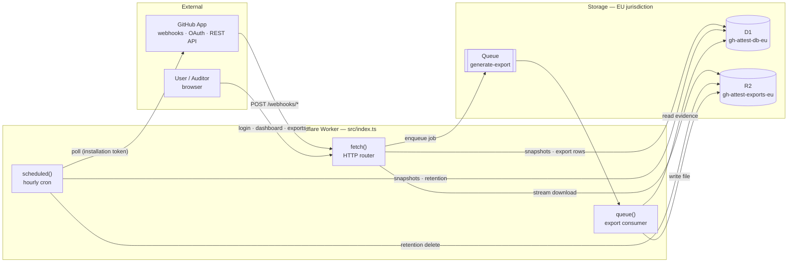
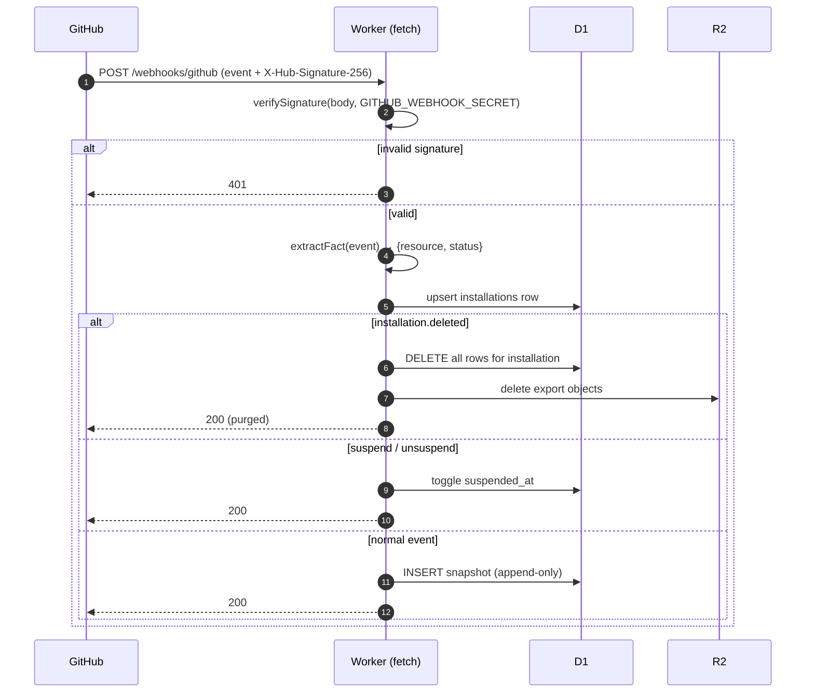
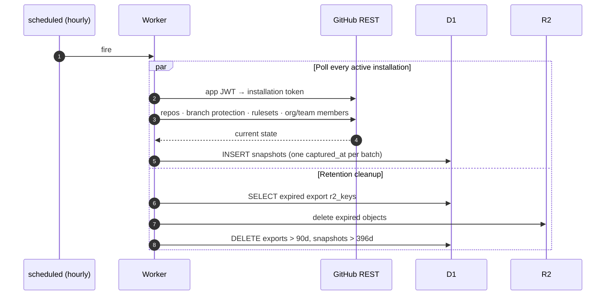
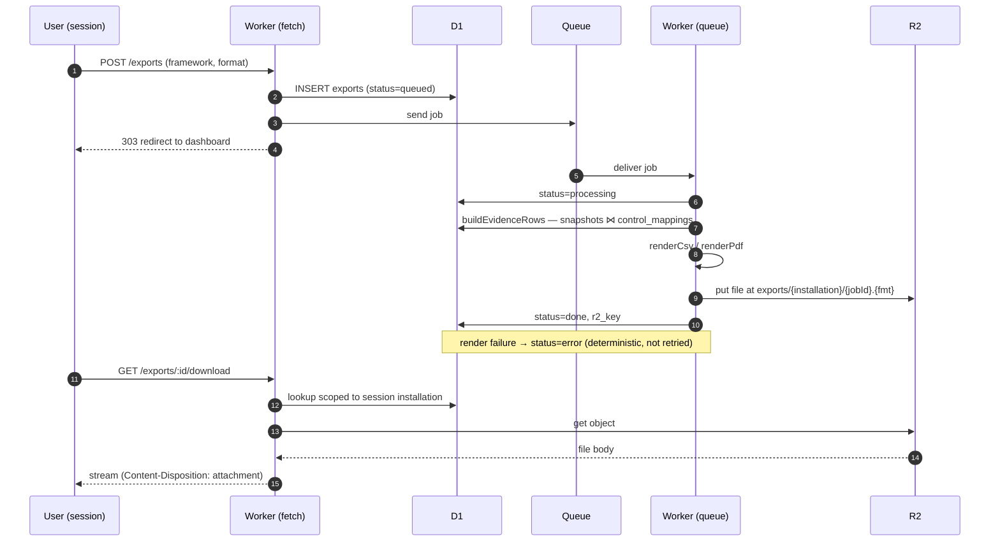
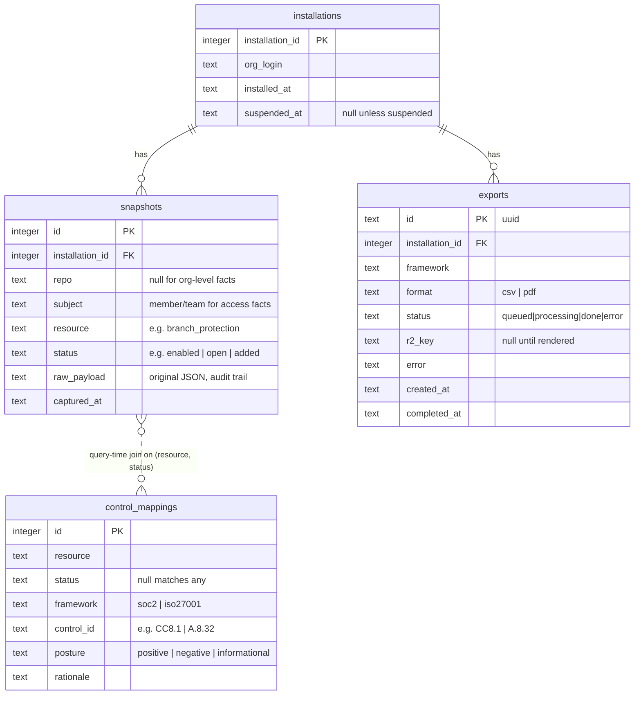
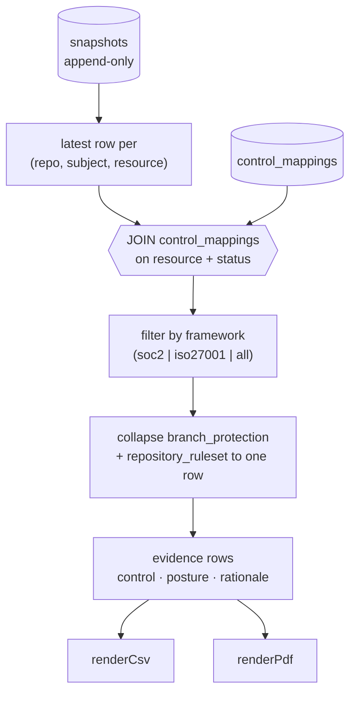

# Architecture

gh-attest is a single [Cloudflare Worker](../src/index.ts) with three entry
points — an HTTP router, an hourly cron, and a queue consumer — backed by D1,
R2, and a Queue, all provisioned in Cloudflare's `eu` jurisdiction. It ingests
GitHub security posture as immutable timestamped snapshots and renders them into
auditor-ready evidence packages mapped to SOC 2 / ISO 27001 controls.

This document is the shape of the system. For *why* a given GitHub signal counts
as evidence for a given control, see [framework-mapping.md](framework-mapping.md).

## System context



## Entry points

| Handler | Trigger | Responsibility | Code |
| --- | --- | --- | --- |
| `fetch` | HTTP request | Webhooks, OAuth/session dashboard, export requests + downloads, admin ops | [index.ts](../src/index.ts) |
| `scheduled` | Cron `0 * * * *` (hourly) | Poll GitHub for state webhooks never announce; enforce retention | [index.ts](../src/index.ts) |
| `queue` | `generate-export` message | Render CSV/PDF off the request path into R2 | [index.ts](../src/index.ts) |

### Routes and their auth

| Route | Auth | Purpose |
| --- | --- | --- |
| `POST /webhooks/github`, `/webhooks/marketplace` | HMAC (`GITHUB_WEBHOOK_SECRET`) | Ingest App / marketplace events |
| `GET /login`, `/callback`, `/logout` | OAuth state cookie | Dashboard sign-in |
| `GET /`, `/access-review` | Session cookie | Posture dashboard, membership diff |
| `POST /exports`, `/resync`, `/switch` | Session cookie | Dashboard actions (installation-scoped) |
| `GET /exports/:id[/download]` | Session cookie | Export status / file (scoped to installation) |
| `POST /admin/{poll,export,cleanup,purge}`, `GET /admin/export/:id` | Bearer (`ADMIN_TOKEN`) | Operations |

## Ingestion — two paths into one table

Both paths write to the append-only `snapshots` table; nothing is ever updated
in place, which is what makes the table a point-in-time audit trail.

### Webhooks (change events)



### Hourly poll + retention (baseline / drift)

Webhooks only fire on change, so protection that existed *before* install, and
current membership, would never appear. The cron closes that gap and enforces
the retention windows in the same invocation.



## Export pipeline

Rendering runs off the request path via the Queue because PDF / large CSV can
exceed request CPU limits. The `exports` row is the job's state machine
(`queued → processing → done | error`).



## Data model

`control_mappings` has **no foreign key** to `snapshots`. Mapping is a join on
`(resource, status)` performed at query/export time — so a mapping can be
corrected without re-ingesting webhook history. A mapping row with `status =
NULL` matches any status for that resource.



### Evidence query

`buildEvidenceRows` ([exporter.ts](../src/exporter.ts)) reduces the append-only
table to current posture, then attaches controls:



Unmapped `(resource, status)` pairs (e.g. `unavailable`, raw `push`) simply
produce no rows — no evidence in either direction.

Classic branch protection and repository rulesets both attest the same control,
so the two are collapsed to one row per (framework, control, repo) — enabled
wins over disabled — rather than letting an unused mechanism report a gap the
other one covers.

## Boundaries & isolation

- **Multi-tenant scoping.** Every session route is scoped to the session's
  `installationId`; the allowed set lives in the signed session, so a tampered
  id can't widen access. Export downloads are looked up with an installation
  filter, so one org can't read another's file by guessing its UUID.
- **Three auth schemes.** HMAC for webhooks, signed session cookies
  (`SESSION_SECRET`) for the dashboard, timing-safe bearer (`ADMIN_TOKEN`) for
  `/admin/*`.
- **Data residency.** D1, R2, and the Queue are all in the `eu` jurisdiction;
  see [wrangler.jsonc](../wrangler.jsonc). No source code or access tokens are
  stored — only posture facts and their raw event JSON.
- **Deletion.** Uninstall (`installation.deleted`) purges all D1 rows and R2
  objects for the installation; `/admin/purge` does the same on request.

## Where things live

| Concern | File |
| --- | --- |
| Router, handlers, retention, purge | [src/index.ts](../src/index.ts) |
| Webhook verification + fact extraction | [src/webhook.ts](../src/webhook.ts) |
| GitHub polling (protection, rulesets, access) | [src/poller.ts](../src/poller.ts) |
| App JWT + installation tokens | [src/github-app.ts](../src/github-app.ts) |
| OAuth + session sign/verify | [src/auth.ts](../src/auth.ts) |
| Evidence query + CSV/PDF rendering | [src/exporter.ts](../src/exporter.ts) |
| Access-review diff | [src/access-review.ts](../src/access-review.ts) |
| Dashboard HTML | [src/dashboard.ts](../src/dashboard.ts) |
| Schema + control mappings | [migrations/](../migrations) |
```
